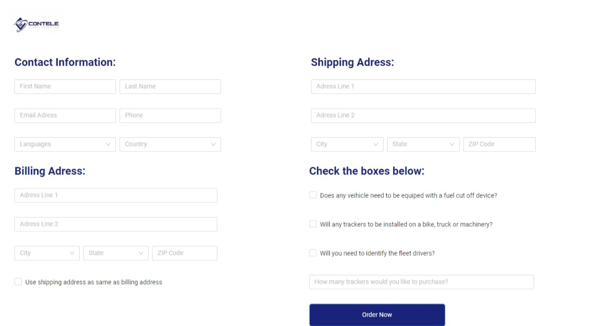

# Junior Developer Test

### This is a project for became a full stack junior developer at **Contele**.

## Technologies used
- Next.js
- Typescript
- Styled-components
- Ant Design

## Implemented features

### Registration screen, with the user registration form, with the fields:

- Name
- Email
- Address
- Phone
- Does any vehicle need to be equiped with a fuel cut off device?
- Will any trackers to be installed on a bike, truck or machinery?
- Will you need to identify the fleet drivers?

## Screenshot
[**Preview**](https://nextjs-styled-typescript.vercel.app/)

