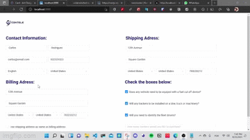

# Contele Developer Test Front

## Projeto desenvolvido para a vaga de desenvolvedor na Contele.

Este é o Front-end do projeto em Next.js, sendo o formulário de cadastro nos idiomas inglês e português.
Possui também uma simulação de banco de dados para teste com o JSON-Server, mas a API completa está em outro repositório. [➡ **Link**](https://github.com/crislerwin/ctl-test-nodejs-api)

## Tecnologias utilizadas

- Next.js
- Typescript
- Styled-components
- Ant Design

## API

## Screenshot

[**Preview**](https://contele.vercel.app/)


## Gif



```json
{
  "first_name": "Crisler",
  "last_name": "Wintler",
  "email": "crislerguitar@gmail.com",
  "phone_number": "32332323",
  "first_adress": "Rua das Palmeiras",
  "second_adress": "Cidade Livre",
  "city": "us",
  "state": "us",
  "zip_code": "232323",
  "language": "en",
  "country": "us",
  "billing_city": "ca",
  "billing_state": "us",
  "billing_zip_code": "3232323",
  "primary_billing_adress": "Rua Canumã 362",
  "second_billing_adress": "Pq Amazonia",
  "fcut_device": true,
  "other_installed_trackers": true,
  "identify_fleet_drivers": true,
  "same_shipping_adress": true,
  "tracker_quantity": 8,
  "id": 8,
  "created_at": "2021-10-02T13:43:48.597Z"
}
```
